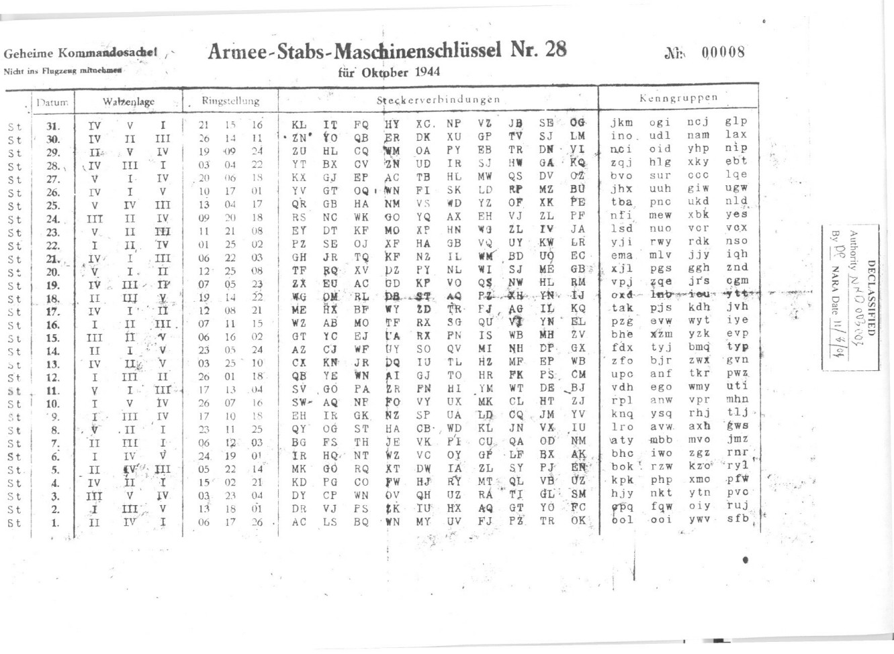
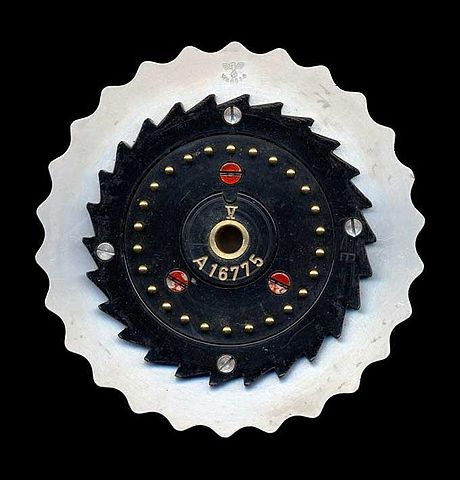

<div align="center">


# Enigma Machine Simulator

A functional **Enigma M3 (Kriegsmarine)** simulator with a Tkinter GUI — built from scratch at age 17, now updated for Python 3.

  



</div>

## Introduction

Built at 17 (Γ' Λυκείου) in Python 2, recently updated to Python 3 while keeping the original 2017 logic. This simulator models the German Enigma M3 machine and lets you explore rotor-based encryption in real time.

## Features

- Choose from 8 rotors (I-VIII)
- Ring settings and start positions for each rotor
- Reflector selection (B/C)
- Plugboard letter swaps
- Live keypress encryption with UI updates
- Optional text mode for long phrase encryption
- Sound effects for key events (Windows)

## How to Run

Open a terminal in the project folder and run:

```
python src/main.py
```

Ensure Python 3.x is installed and leave `assets/` in place for sound and image resources.

## Requirements

- Python 3.x
- Tkinter (standard with Python)
- Sound effects use `winsound` and play on Windows only; the app runs without sound on macOS/Linux.

## How it works

The encryption pipeline mirrors the real machine: each letter passes through the
plugboard, then the three rotors, bounces off the reflector, returns back through
the rotors and the plugboard. Stepping (including the double-step anomaly) and the
dual-notch rotors VI-VIII are modelled faithfully.

<p align="center">
  
</p>

For a full breakdown of the algorithm, see [`docs/ALGORITHM.md`](docs/ALGORITHM.md).

## Code modules

- `src/main.py` — GUI and user interaction
- `src/engine.py` — Enigma machine logic
- `src/wckToolTips.py` — tooltip helper

## Notes

- The repository is a cleaned version of older source archives.
- Archive versions are kept under `archive/` for historical reference.
- The code is preserved in original style and is educational, not production-grade.

## Image credits

Historical images are included for educational illustration:

- Enigma rotor photographs — from Wikimedia Commons:
  [pin contacts](https://commons.wikimedia.org/wiki/File:Enigma-rotor-pin-contacts.jpg) and
  [flat contacts](https://commons.wikimedia.org/wiki/File:Enigma-rotor-flat-contacts.jpg).
  See each file page for the original author and licence.

## Credits

Original Project (2017) by Dimitris Tzakas. Updated for Python 3 compatibility in 2026.
